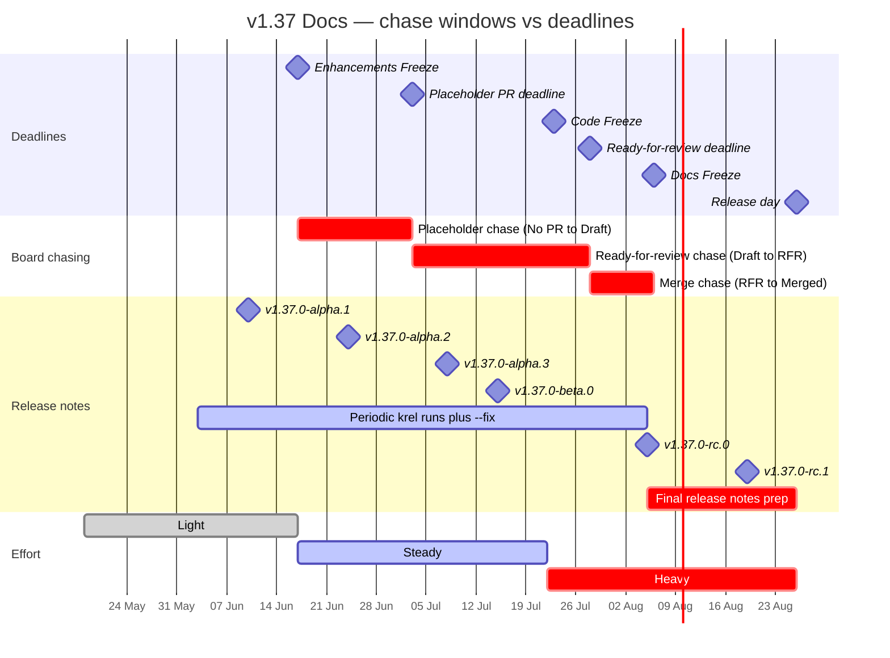

# Kubernetes v1.37 Docs Shadow Runbook

A self-contained guide for a new SIG Release Docs Shadow on the v1.37 cycle. Reference material comes first (links, access, tools, timeline, glossary); the two recurring procedures come last.

Docs Lead: Tushar Mittal ([@kernel-kun](https://github.com/kernel-kun)). Release Lead: Dipesh Rawat ([@dipesh-rawat](https://github.com/dipesh-rawat)).

---

## 1. What a Docs Shadow does

A Docs Shadow helps the Docs Lead get the release-bound documentation and release notes ready for ship day. Day to day that means two recurring jobs — running the weekly branch sync that merges `main` into the release `dev-1.37` branch on the website, and running `krel` to generate and copy-edit the release notes draft — plus tracking enhancement docs PRs, chasing KEP owners for placeholder PRs before the docs deadlines, and giving status in the weekly Release Team and SIG Docs meetings. The work is light at the start of the cycle and intense in the final weeks; the running joke is "hurry up and wait."

### TL;DR checklist

- [ ] Join the six Slack channels and the Google Groups (see [§3](#3-prerequisites--access-setup)).
- [ ] Subscribe to the [Release Team Calendar](https://rel.k8s.io/release-team-cal) and the [general Kubernetes calendar](https://calendar.google.com/calendar/embed?src=calendar%40kubernetes.io) (SIG Docs meeting links).
- [ ] Sign the CNCF CLA; make sure your git `user.email` matches it.
- [ ] Fork and SSH-clone `k/website`, `k/sig-release`.
- [ ] Install `krel` and create a `GITHUB_TOKEN` with `public_repo` scope.
- [ ] Take a turn on the [weekly branch sync](#7-weekly-sync-pr-branch-sync) (usually Friday).
- [ ] Take a turn generating/reviewing the [release notes draft](#8-krel-core-release-notes) after each alpha/beta/rc.
- [ ] Watch the [docs deadlines](#5-timeline-overlay): placeholder PRs (3 Jul), PRs ready for review (28 Jul), Docs Freeze (6 Aug), release day (26 Aug).

---

## 2. Link directory

| Resource                                        | Link                                                                                                       |
| ----------------------------------------------- | ---------------------------------------------------------------------------------------------------------- |
| Docs Role Handbook                              | https://github.com/kubernetes/sig-release/tree/master/release-team/role-handbooks/docs                     |
| Docs Release Timeline (exhaustive)              | https://github.com/kubernetes/sig-release/blob/master/release-team/role-handbooks/docs/Release-Timeline.md |
| Release notes editing flow                      | https://github.com/kubernetes/sig-release/blob/master/release-team/role-handbooks/docs/editing-flow.md     |
| Release Team Onboarding Guide                   | https://github.com/kubernetes/sig-release/blob/master/release-team/release-team-onboarding.md              |
| v1.37 Release Information (schedule)            | https://github.com/kubernetes/sig-release/blob/master/releases/release-1.37/README.md                      |
| v1.37 Release Team roster                       | https://github.com/kubernetes/sig-release/blob/master/releases/release-1.37/release-team.md                |
| v1.37 Release Links                             | https://github.com/kubernetes/sig-release/blob/master/releases/release-1.37/links.md                       |
| Release Team Calendar                           | https://rel.k8s.io/release-team-cal                                                                        |
| General Kubernetes calendar (SIG Docs meetings) | https://calendar.google.com/calendar/embed?src=calendar%40kubernetes.io                                    |
| v1.37 Release Tracking board (Docs view)        | https://github.com/orgs/kubernetes/projects/264/views/3                                                    |
| v1.37 milestone (k/k)                           | https://github.com/kubernetes/kubernetes/milestone/70                                                      |
| v1.37 Release Meeting notes                     | https://docs.google.com/document/d/19xTpCJ_dSKDNI0IyOjyDqFnkmVGEP4rUwqKRgRtE7Ac/                           |
| v1.37 Contact sheet                             | https://docs.google.com/spreadsheets/d/1tDOHk6uWO5D83xE0SYyUpEnO_q3jKV1UFZWMZoyKQwI/                       |
| krel — install                                  | https://github.com/kubernetes/release/tree/master/docs/krel#installation                                   |
| krel — `release-notes` subcommand               | https://github.com/kubernetes/release/blob/master/docs/krel/release-notes.md                               |
| Branch sync script                              | https://github.com/kubernetes/sig-release/tree/master/release-team/role-handbooks/docs/branch-sync-script  |
| Release notes website                           | https://relnotes.k8s.io                                                                                    |
| Documentation Style Guide                       | https://kubernetes.io/docs/contribute/style/style-guide/                                                   |
| testgrid — sig-release-1.37-blocking            | https://testgrid.k8s.io/sig-release-1.37-blocking#Summary                                                  |
| testgrid — sig-release-master-blocking          | https://testgrid.k8s.io/sig-release-master-blocking#Summary                                                |
| Kubernetes Slack signup                         | https://slack.k8s.io/                                                                                      |

---

## 3. Prerequisites / access setup

### GitHub identity and membership

- **Sign the CNCF CLA** before your first PR. The CLA bot only triggers on your first PR to the `kubernetes` org, so file a throwaway PR in [`kubernetes-sigs/contributor-playground`](https://github.com/kubernetes-sigs/contributor-playground) to clear it early. Your git `user.email` must match the email on the CLA, or krel's PR checks fail.
- **Use DCO sign-off** on every commit: `git commit -s`.
- **Apply for org membership** (`kubernetes` and `kubernetes-sigs`) by opening a [membership request issue](https://github.com/kubernetes/org/issues/new?assignees=&labels=area%2Fgithub-membership&template=membership.yml&title=REQUEST%3A+New+membership+for+%3Cyour-GH-handle%3E). Use the Release Lead and the SIG Release subproject lead as sponsors. Shadows do not always need org membership on day one — confirm timing with the Docs Lead.
- Ask the Docs Lead to add you to the **`release-team-docs`** GitHub group so you can see the [v1.37 tracking board Docs view](https://github.com/orgs/kubernetes/projects/264/views/3).

### Forks and clones

Fork these to your account and clone via SSH:

- [`kubernetes/website`](https://github.com/kubernetes/website) — release docs and the `dev-1.37` branch you sync into.
- [`kubernetes/sig-release`](https://github.com/kubernetes/sig-release) — where the release notes draft PRs land.

### Slack

Join via https://slack.k8s.io/ and introduce yourself in `#sig-release` as a v1.37 Docs Shadow:

`#sig-release` · `#sig-docs` · `#release-docs` · `#release-notes` · `#release-management` · `#release-comms`

### Google Groups

| Group                                                                                               | How to join                                                                                             |
| --------------------------------------------------------------------------------------------------- | ------------------------------------------------------------------------------------------------------- |
| [kubernetes-sig-release](https://groups.google.com/forum/#!forum/kubernetes-sig-release)            | Join via the URL                                                                                        |
| [kubernetes-sig-docs](https://groups.google.com/forum/#!forum/kubernetes-sig-docs)                  | Join via the URL                                                                                        |
| [kubernetes-dev](https://groups.google.com/a/kubernetes.io/g/dev)                                   | Join via the URL                                                                                        |
| [kubernetes-release-team](https://groups.google.com/a/kubernetes.io/g/release-team)                 | Added for you in the roster `groups.yaml` PR — confirm with the Docs Lead if you can't access the group |
| [kubernetes-release-team-shadows](https://groups.google.com/a/kubernetes.io/g/release-team-shadows) | Added for you in the roster `groups.yaml` PR — confirm with the Docs Lead if you can't access the group |

### Calendar and tooling

- Subscribe to the [Release Team Calendar](https://rel.k8s.io/release-team-cal) for release-cycle events, and the [general Kubernetes calendar](https://calendar.google.com/calendar/embed?src=calendar%40kubernetes.io) for SIG Docs meeting links.
- Install `krel` and create a `GITHUB_TOKEN` (`public_repo` scope) — details in [§8](#8-krel-core-release-notes).

---

## 4. Tools & Scripts (nav map)

| Tool / script                      | What it does                                                   | Where                                                                                                                                                     |
| ---------------------------------- | -------------------------------------------------------------- | --------------------------------------------------------------------------------------------------------------------------------------------------------- |
| `branch-sync.sh`                   | Weekly merge of `main` into `dev-1.37` on the website fork     | [§7](#7-weekly-sync-pr-branch-sync) · [script](https://github.com/kubernetes/sig-release/tree/master/release-team/role-handbooks/docs/branch-sync-script) |
| `krel release-notes`               | Generates and copy-edits the release notes draft; opens the PR | [§8](#8-krel-core-release-notes) · [guide](https://github.com/kubernetes/release/blob/master/docs/krel/release-notes.md)                                  |
| krel `--fix` editing flow          | Interactive note-by-note review; writes map YAML               | [§8](#8-krel-core-release-notes) · [editing flow](https://github.com/kubernetes/sig-release/blob/master/release-team/role-handbooks/docs/editing-flow.md) |
| Release Tracking board (Docs view) | Tracks each enhancement's docs PR status                       | [board](https://github.com/orgs/kubernetes/projects/264/views/3)                                                                                          |
| Documentation Style Guide          | The standard every doc and release note is reviewed against    | [style guide](https://kubernetes.io/docs/contribute/style/style-guide/)                                                                                   |
| relnotes.k8s.io                    | Published release notes website (auto-updated)                 | [relnotes](https://relnotes.k8s.io)                                                                                                                       |

---

## 5. Timeline overlay

All deadlines are **Anywhere on Earth (AoE)** — the day ends in the last timezone on Earth (UTC-12), so the practical UTC cutoff is noon the next day. "Load" is the Docs team's effort that week.

| Week | Dates                                  | Milestone                                                                                | Docs load                                    |
| ---- | -------------------------------------- | ---------------------------------------------------------------------------------------- | -------------------------------------------- |
| 1    | Mon 18 May 2026                        | Cycle begins; team and schedule finalized                                                | Light — onboarding, access setup             |
| 2    | from 27 May 2026                       | APAC-friendly meetings begin                                                             | Light                                        |
| 4    | Wed 10 Jun 2026                        | v1.37.0-alpha.1; PRR Freeze (9 Jun AoE)                                                  | Light — first krel run                       |
| 5    | 16–17 Jun 2026                         | Enhancements Freeze; KubeCon India 18–19 Jun                                             | Steady — placeholder chase opens             |
| 6    | Wed 24 Jun 2026                        | v1.37.0-alpha.2                                                                          | Steady — placeholder chase                   |
| 7    | **Thu 2 Jul (AoE) / Fri 3 Jul 2026**   | **Docs deadline: open placeholder PRs**                                                  | **Steady (spike) — placeholder PR deadline** |
| 8    | Wed 8 Jul 2026                         | v1.37.0-alpha.3; Feature blog freeze (9 Jul AoE)                                         | Steady — ready-for-review chase              |
| 9    | Wed 15 Jul 2026                        | v1.37.0-beta.0; call for Code Freeze exceptions                                          | Steady — ready-for-review chase              |
| 10   | **Wed 22 Jul (AoE) / Thu 23 Jul 2026** | **Code Freeze + Test Freeze**                                                            | **Heavy — Code Freeze; ramp begins**         |
| 11   | **Tue 28 Jul 2026**                    | **Docs deadline: PRs ready for review**; Burndown begins 27 Jul; KubeCon Japan 28–30 Jul | **Heavy — ready-for-review deadline**        |
| 12   | **Wed 5 Aug (AoE) / Thu 6 Aug 2026**   | v1.37.0-rc.0; release-1.37 branch cut; start final draft; **Docs Freeze**                | **Heavy (peak) — Docs Freeze**               |
| 13   | Thu 13 Aug (AoE) / Fri 14 Aug 2026     | Release blog ready to review                                                             | Heavy                                        |
| 14   | Wed 19 Aug 2026                        | v1.37.0-rc.1                                                                             | Heavy                                        |
| 15   | **Wed 26 Aug 2026**                    | **v1.37.0 released; release notes complete; blog published; Thaw**                       | **Heavy (peak) — release day**               |

Quiet stretches: weeks 1–6. Crunch windows: the placeholder-PR push (week 7), and everything from Code Freeze through release day (weeks 10–12 and week 15).

### Crunch overlay

Each chase begins at the _previous_ freeze, not at its own deadline. The diagram shows the three board-chasing windows (red) overlaid on the freezes (milestones) and the running release-notes work, with the team's effort level along the bottom.



**Reading the chase windows.** Each one drives one board-column transition, and starts the moment the prior freeze lands:

- **Placeholder chase** (Enhancements Freeze → 3 Jul): every opted-in KEP starts at _Needs Docs / No PR_; goal is at least a _Draft PR_ by the deadline. Status target: ≥80% have a placeholder PR ~1 week out (≈25 Jun), ≥90% ~3 days out (≈29 Jun) — below that is yellow/red in the weekly update.
- **Ready-for-review chase** (3 Jul → 28 Jul): push _Draft_ PRs to _Ready-for-Review_. After Code Freeze (23 Jul) do the relabel pass, marking each KEP _At Risk_ or _Tracked for Docs Freeze_. Target: ≥80% ready ~1 week out (≈21 Jul), ≥90% ~3 days out (≈25 Jul).
- **Merge chase** (28 Jul → 6 Aug): drive _Ready-for-Review_ PRs to _Merged_ — each needs both `/lgtm` and `/approve`. Target: ≥80% merged ~1 week out (≈29 Jul), ≥90% ~3 days out (≈2 Aug). The week of Docs Freeze, follow up on every PR not yet mergeable.

**Expected load.** Weeks 1–6 are light: onboarding, the first krel runs, and weekly branch syncs. Effort climbs once the placeholder chase opens (week 5) and spikes at the week-7 deadline. Weeks 8–9 ease to steady, then Code Freeze (week 10) starts the long ramp: the ready-for-review and merge chases stack on top of daily Burndown meetings and accelerating release-notes work, peaking at Docs Freeze (week 12) and again on release day (week 15). Plan for ≥5 hours/week in those final weeks. Two KubeCons fall inside crunch — India (18–19 Jun, week 5) and Japan (28–30 Jul, week 11) — so arrange coverage on the signup sheet early.

---

## 6. Glossary

| Term                | Meaning                                                                                                           |
| ------------------- | ----------------------------------------------------------------------------------------------------------------- |
| SIG                 | Special Interest Group — a standing subteam of the project (e.g. SIG Docs, SIG Release).                          |
| KEP                 | Kubernetes Enhancement Proposal — the design doc for a feature; the unit Docs tracks for documentation.           |
| krel                | The Kubernetes Release Toolbox; its `release-notes` subcommand is what Docs runs.                                 |
| Release note        | The user-facing summary a contributor writes in their PR's release-note block.                                    |
| Release Notes Draft | The aggregated markdown (`release-notes-draft.md`) in sig-release that becomes the final notes.                   |
| Map file            | A YAML edit overlay (under `release-notes/maps/`) that krel applies to fix a note without touching the source PR. |
| Session file        | krel's saved review state (under `release-notes/sessions/`) so you can pause and resume.                          |
| AoE                 | Anywhere on Earth — a deadline that ends only when the date passes in UTC-12.                                     |
| PRR                 | Production Readiness Review; the PRR Freeze gates whether an enhancement can ship.                                |
| Enhancements Freeze | Cutoff after which no new KEPs are accepted into the release.                                                     |
| Code Freeze         | Cutoff after which only bug fixes (not features) merge to the release branch.                                     |
| Test Freeze         | Cutoff after which release-blocking test jobs are locked for stability.                                           |
| Docs Freeze         | Cutoff after which release docs must be complete; the Docs team's hard deadline.                                  |
| Burndown            | The recurring meetings (from Code Freeze to release) that drive remaining work to zero.                           |
| Thaw                | Reopening `main` for normal development after the release ships.                                                  |
| dev branch          | `dev-1.37` on the website repo — the target branch for all v1.37 release docs.                                    |
| Placeholder PR      | An early stub PR against `dev-1.37` reserving a spot for a KEP's docs.                                            |
| Branch sync         | The weekly merge of `main` into `dev-1.37` to avoid release-day conflicts.                                        |
| OWNERS              | The file that controls who can review and approve changes in a directory.                                         |
| DCO                 | Developer Certificate of Origin; satisfied with `git commit -s`.                                                  |
| CLA                 | Contributor License Agreement; must be signed before contributions are accepted.                                  |
| Prow                | The Kubernetes CI and automation bot that applies labels and runs `/lgtm`, `/approve`, etc.                       |
| relnotes.k8s.io     | The public release notes website, generated from the notes data.                                                  |
| LWKD                | Last Week in Kubernetes Development, a community newsletter at https://lwkd.info.                                 |

---

## 7. Weekly sync PR (branch sync)

**Goal:** every week, merge upstream `main` into the website's `dev-1.37` branch so the two don't diverge and conflict on release day. Cadence: weekly, usually Friday; ownership rotates on the team signup sheet.

The handbook ships a helper script: [`branch-sync.sh`](https://github.com/kubernetes/sig-release/tree/master/release-team/role-handbooks/docs/branch-sync-script).

### Steps

1. Make sure you have a fork of `kubernetes/website` and your SSH key is set up.
2. Run the script with the release number and your GitHub user:
   ```bash
   ./branch-sync.sh 1.37 -u <your-github-user>
   ```
   Add `-p` to push automatically; omit it to be prompted first.
3. The script clones your website fork, adds `upstream` (push disabled), fetches `main` and `dev-1.37`, checks out `dev-1.37`, then runs:
   ```bash
   git merge upstream/main -m "Merge main into dev-1.37 to keep in sync"
   ```
4. If there is a **merge conflict**, the script stops. Resolve it locally, `git add` the files, and commit with the same message. Flag for help in `#release-docs` if needed.
5. The script creates a branch `merged-main-dev-1.37` and pushes it to your fork.
6. Open a PR on GitHub from your fork's `merged-main-dev-1.37` branch with the **base set to `dev-1.37`** (not `main`).
7. Report sync status in the weekly Release Team update. A lapse of one or two syncs is "yellow"; three or more is "red."

### Real examples to mirror

- v1.37: [website#55936 — Merge main branch into dev-1.37](https://github.com/kubernetes/website/pull/55936)
- Canonical title/message: [website#54636 — Merge main into dev-1.36 to keep in sync](https://github.com/kubernetes/website/pull/54636)
- Final sync of a cycle: [website#55469 — [Final sync] Merge main into dev-1.36](https://github.com/kubernetes/website/pull/55469)

---

## 8. krel core (release notes)

**Goal:** generate the release notes draft after each `alpha`, `beta`, and `rc`, copy-edit the new notes, and open a PR back to `sig-release`. Cadence: after every pre-release tag, with weekly `--fix` passes; ownership rotates.

### Set up krel

Install (any one):

```bash
./hack/get-krel                       # from a kubernetes/release checkout
./compile-release-tools krel          # from a kubernetes/release checkout
go install k8s.io/release/cmd/krel@latest
```

Full install guide: https://github.com/kubernetes/release/tree/master/docs/krel#installation

Create a [GitHub token](https://github.com/settings/tokens) with only the **`public_repo`** scope and export it:

```bash
export GITHUB_TOKEN=YOURTOKENHERE
```

### Generate and edit the draft

Run the `release-notes` subcommand with `--create-draft-pr` (update the draft) and `--fix` (interactive editing), pointing `--fork` at your GitHub user and `--tag` at the version you are cutting notes for:

```bash
krel release-notes \
   --create-draft-pr \
   --fork=<your_username> \
   --tag "v1.36.0-alpha.1" \
   --log-level trace --fix 2>&1 | tee krel-output.log
```

- `--tag` is set explicitly per release (`v1.37.0-alpha.2`, `…-beta.0`, `…-rc.0`, and so on).
- krel clones `kubernetes/kubernetes`, queries every PR in range (this can be slow late in the cycle), then walks you through each unreviewed note.
- For a note that needs fixing, krel opens it in `$EDITOR`. Uncomment and change the field(s); saving writes a **map YAML** under `releases/release-1.37/release-notes/maps/`. `pr:` and `releasenote:` must stay uncommented.
- Press `Ctrl+C` to stop at any time; your progress is saved as a **session** under `releases/release-1.37/release-notes/sessions/`, so the next run only shows new notes.
- On exit, krel offers to open the PR — it pushes a branch to your `sig-release` fork and files the PR for you. If you decline, it leaves the local clone in a temp dir for you to push manually.

Editing-flow reference: https://github.com/kubernetes/sig-release/blob/master/release-team/role-handbooks/docs/editing-flow.md

### Reviewing the draft PR

The assigned reviewer checks that every PR merged since the last tag was processed, that notes follow the [style guide](https://kubernetes.io/docs/contribute/style/style-guide/) (past tense, explained jargon, useful context), that `ACTION_REQUIRED` placement and the SIG label on each note are correct, and that the markdown, JSON, and map files stay in sync.

### Real examples to mirror

- [sig-release#3003 — Release Notes draft for k/k v1.36.0-rc.1](https://github.com/kubernetes/sig-release/pull/3003)
- [sig-release#2982 — Update release notes draft to version v1.36.0-beta.0](https://github.com/kubernetes/sig-release/pull/2982)
- [sig-release#2957 — Update release notes draft to version v1.36.0-alpha.1](https://github.com/kubernetes/sig-release/pull/2957)

---

## 9. Closing note: you learn this by doing

Some of this only clicks once you are in it. Don't expect to feel fluent from the handout alone:

- **krel under load.** Rate limiting, slow clones near code freeze, and resuming from session files only make sense after a real run. Your first run will feel slow; that's normal.
- **Merge-conflict resolution on the branch sync.** Reading the steps is easy; resolving a real conflict between `main` and `dev-1.37` is a judgment call you'll get faster at each week.
- **Judging release-note quality.** Deciding what belongs in `ACTION_REQUIRED`, rewriting a terse note into something a user understands, and getting the SIG label right are learned by reviewing many notes.
- **Chasing placeholder PRs.** This is social, not technical — knowing who to ping, when, and how persistently is something you pick up by doing the week-7 push.
- **Release day.** Merging the docs, publishing the blog, and unfreezing the website is the biggest single block of the cycle and the hardest to rehearse. Shadow the Lead closely the first time.

When in doubt, ask in `#release-docs` early rather than late.
